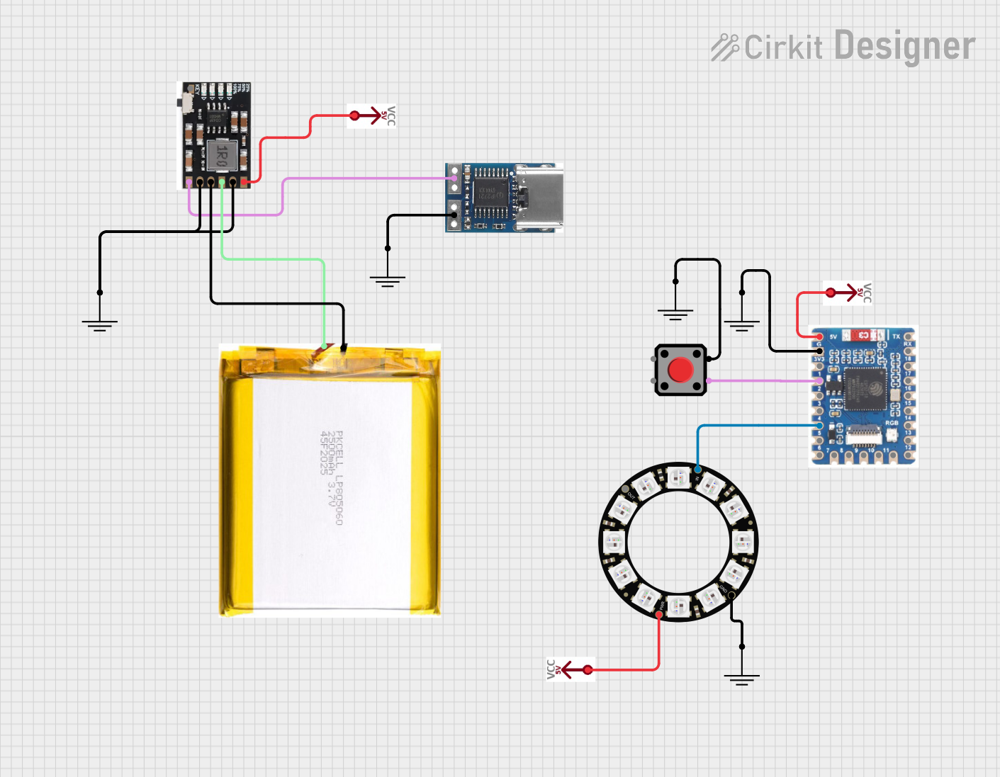

# [WIP] 🔴 Big Red Button (BRB for short)

## A wireless bluetooth button that does anything

This is a Bluetooth-controlled device that emulates a Bluetooth mouse, allowing it to appear as a standard input device to Windows and macOS. This enables it to be paired with the OS without installing any drivers or additional software. This is the V3 version of the button, where i experimented a lot with parts and printed circuit boards!

The device uses BLE (Bluetooth Low Energy) to communicate wirelessly via Bluetooth characteristics (think of it like wireless variables) that can be changed by a device that is authenticated with the device.

## WHy & how did i build this?

What led me to redo the BRB (🔴) _again_ was the desire to make the perfect button, and that meant that v1 and v2 were not perfect. For one, the v2 project kept restarting on battery, and i just had way to many wires. The button itself was big and noisy, and used a 12V LED that i could barely see and needed a boost converter to take 5V into 12V.

For this revision, i wanted all on 5V, which meant rebuilding the button itself. Since i had a few spare keyboard Cherry MX switches and a Neopixel that i ended up storing away, i've settled on using those parts for this revision. For the dome part, i decided to take apart the red button of V1, and repurposed the battery of V2.

I experimented _a lot_ on this revision. Went with magnetic connectors for the bottom and top part, custom made PCBs (i designed them myself, and even milled one on a CNC device), a big (i mean _huge_) keycap for the Cherry MX with 12 powerful 5V LEDS! The "net new" parts ended up being a IP5603 module to manage the charging of the battery and a few accessory parts for the enclosure.

I ended designing 2 versions of both top and bottom PCB's, a surface mount version and a through hole version that could be milled on a CNC, I ended up designing them as a experiment and learning exercise!

### Why not TP4056?

I researched a lot about battery management IC's, and had to make a fiww design options early on, so i could find the chip that i would need. My requirements were:
- Needs a power path, meaning that it can be used while charging
- Needs to be suitable for low charging currents, or the charging current should be configurable
- Needs to be suitable for LiPo pouch cells.
- It would be nice to have I2C for battery percentage
- It would be nice to have an integrated boost converter 

After my research, ended up with a few options:  TP4056, IP5603, BQ25185, BQ25895, MCP73871. They all have advantages:
- TP4046 is the simplest of them all, but doesn't transform the output of the battery to 5V, and i really need those 5V. You can definitely add a boost circuit for the output, but i didn't want to bother with that
- IP5603 does transform the power to 5V, but it only provides visual indicators for battery percentage. It's also relatively simple to build a circuit around this one. However, this chip uses a pushbutton to enable / disable the battery power and it's not suitable for LiPo pouch cells as it charges with high currents, more suitable for 18650 battery packs
- BQ25895 can provide a 5V power and battery percentage information over I2C protocol, which is awesome, but the reference circuit is a bit too scary for me to try, and it's a bit outta my league.
- BQ25185 ticks a lot of those boxes. It has a power path, i can configure to charge on low currents which makes it suitable for my LiPo cell. However, i'll have to add my own boost converter to get stable 5V and 1A out of the battery.
- MCP73871 is in some ways just a simple version of the BQ25185, with less features and a easier footprint to handle. It still needs to boost converter.

Ultimately, I decided to go with a BQ25895 +  TPS61023 combo, since i was able to find a test board that i could use on a breadboard to validate the design.

### Software used
- EasyEDA for schematic and PCB Design
- Flatcam for board milling
- Arduino IDE to code the ESP32's

#### Parts List (Bottom)
- ESP32-S3-Tiny
- BQ25185DLHR (Battery Charger)
     - configured for 300ma charge rate 
     - and 500ma input rate
     - 74438357010 Inductor (recommended by datasheet)
     - X5R Capacitors (recommended by datasheet, for cost)
- TPS61023DRLR
    - Configured for 5V, 1.1A
- L584070 (CELLEVIA) LiPo Battery
- Panel-mounted USB Port (with resistors on CC1 & CC2)

#### Parts List (Top)
- Cherry MX Red
- 12 WS2812 LEDs wired in a ring configuration 

### Detailed PCB Specs

The electronics themselves are wired on two separate PCBs: the top PCB that has the lights and buttons, and the bottom PCB handles the power and logic control. The PCB's are then connected together.

The PCB's were designed to be 2 Layers (Signal, Ground) on the bottom PCB  and 4 layers (VCC, Ground, Signal, Ground) on the Top PCB

## Inner workings

### Mouse Emulation

This device uses Bluetooth Low Energy (BLE) to emulate a mouse via the HID (Human Interface Device) profile. By creating a fake mouse, it appears to the host (Windows or macOS) as a standard mouse. And with BLE, we can create our own functionalities (custom characteristics) and attach it to the fake mouse device, and have some python code to write on those.

The fake mouse is needed for Windows and MacOS, that refuse to accept input of devices that are don't provide HID functionality, but i assure you that the mouse is controlled by the device, it just emulates the device characteristics of a mouse.

### BLE Services and Characteristics

In Bluetooth Low Energy (BLE), communication is structured around services and characteristics. A service is a collection of related functionality, like a HID service for mouse input or a battery service for reporting battery level. Each service contains one or more characteristics, which represent individual pieces of data that can be read, written, or notified.

For example, this device implements:

- A HID service, which includes characteristics to send mouse reports (movement or button presses).
- A Battery service, with a battery level characteristic which exposes the current battery level to the connected device.
- A Custom Button service, with a single characteristic which notifies the host when the physical button is pressed.

### You said it could do anything?

Yes, with the help of some python code we can make the mic mute globally, trigger a lock screen or just rick-roll somebody. The host application was built using Rumps and Python to build a menu bar GUI. I'm not sure if this is compatible with Linux and Windows but at least works on Mac (:joy:)

## Assembling one yourself

### Bill of Materials (if you wanna build it yourself)

- [Waveshare ESP32-Tiny](https://www.waveshare.com/esp32-s3-tiny.htm) or a [Seed XIAO ESP32-S3](https://www.seeedstudio.com/XIAO-ESP32S3-p-5627.html)
- [Big Dome Pushbutton](https://www.sparkfun.com/products/9181), you will need just the "dome" part
- [BQ2185 Charger Board](https://www.adafruit.com/product/6092)
- USB power input via:
    - A USB Panel mount to 2 wires (something like this https://www.adafruit.com/product/6072, that has a red and a black wire)
    - A USB-C 5V PD decoy chip (pay attention to the 5V, it needs to be 5V)
- A Lithium Battery (mind the Amps)
- A 12 RGB LED NeoPixel (https://www.adafruit.com/product/1643)
- A Cherry MX Switch (any type)
- And a NeoKey breakout board (https://www.adafruit.com/product/4978, or you can just use a cherry mx like a simple button)

## Easy circuit to follow 

Assemble your parts like the image below

>[!IMPORTANT]
> The ground (the black wire) is a common ground. This means that all grounds need to be connected between each other

Try to solder into a protoboard for less wires. The enclosure here won't work so you will have to adjust the enclosure to match the footprint